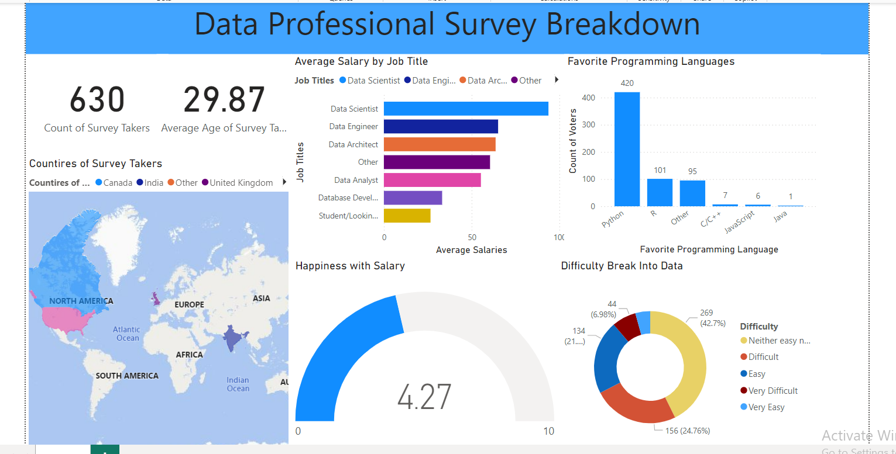

<h1>Power BI Full Projects...</h1>

<h3>Different Visualizations and Dashboards:</h3>

1. Food Product Visualization

2. Second Visualization for Power Query of Power BI

3. Third Visualization for Table Relations of Power BI

4. 4th Visualization for Dax

5. 5th Visualization for Drill Down

6. 6th Visualization for Conditional Formatting

7. 7th Visualization for Bins and Lists

8. 8th All Different Visualization of Power BI

9! Final Real Project and Dashboard: 
   

<h3>
    <a href="https://app.powerbi.com/groups/me/reports/b8418d46-b129-4138-aa23-4e9e3f8a1d70/395c1f286c89e325a6c0?experience=power-bi">
        Professional Employees Survey Dashboard
    </a>
</h3>
  

<h3>
    <a href="https://app.powerbi.com/groups/me/reports/2d73b656-9591-4c40-b7b1-1bbe801bf882/6e57299067a38c2245d8?experience=power-bi">
        Household Water Usage in 1year by Family Size
    </a>
</h3>

